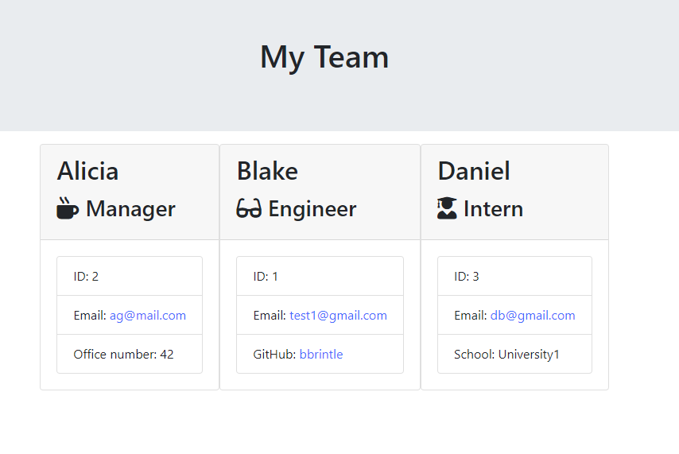

# Template Engine: Employee Summary

## Table of Contents
1. [ Description ](#desc)
2. [ Installation ](#install)
3. [ Usage ](#usage)
4. [ License ](#lic)
5. [ Questions ](#quest)
    

## 1. Description
One of the most important aspects of programming is writing code that is readable, reliable, and maintainable. Oftentimes, how we design our code is just as important as the code itself. This application builds a Node CLI that takes in information about employees and generates an HTML webpage that displays summaries for each person.
    

## 2. Installation
Make sure to have the package.json file in the folder then type "npm install" in your terminal. The neccessary files will install automatically.
app.js file must be ran using node.js
    

## 3. Usage
Select the role of the employee (Manager, Engineer or Intern) and then answer the follwing questions about the employee. Continue this until you no longer have any employees let to enter. Once no more employees remain, select "No more team members". The team.html file within the 'output' folder will update with all of the members entered.
 

    

## 4. License
MIT
    

## 5. Questions
Please visit my GitHub to view all of my work:
https://www.github.com/bbrintle 

Contact me at: bbrintle@gmail.com